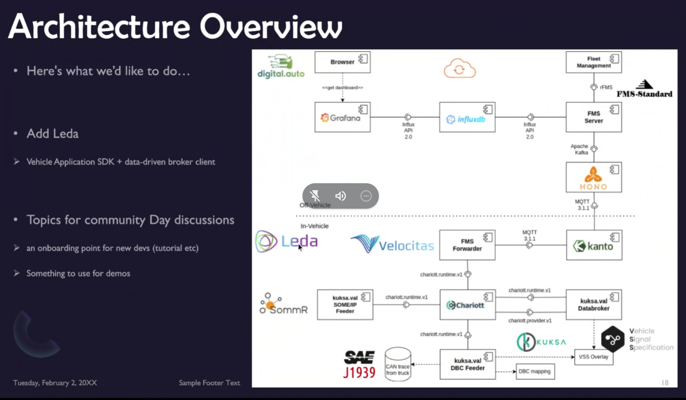

## Fleet Ops
| Truck Fleet Ops| |
|---|---|
|Short Summary | A close to "real-life" showcase for truck fleet management where trucks run SDV stacks so that logistics fleet operators can manage apps, data and services for a diverse set of vehicles.|
|What is in the showcase | Data collection from CANBus, In vehicle data brokers, VSS Signal Specification, FMS servers, Apps and Services using this data|
|SDV Projects Involved| Leda, Kuksa, Velocitas, Charriot, SommR?|
|Other interesting Technologies|InfluxDB, Prometheus, Eclipse Hono, Eclipse Kanto, Digital.Auto |
| Architecture Overview | |
| Distro | TBD|
| Coordinator | Kai Hudalla |

#  Getting Started
Lorem ipsum dolor sit amet, consectetur adipiscing elit. Phasellus ultrices rutrum tellus eget euismod. Nullam mauris metus, tincidunt quis scelerisque et, accumsan a ligula. Morbi eget tempus lacus. Ut sollicitudin laoreet nibh at ullamcorper. Maecenas at semper augue. Donec pulvinar bibendum lectus sit amet convallis. Vestibulum rhoncus mi in congue dictum. Proin mollis tristique elit, eu bibendum tellus pellentesque faucibus. Sed accumsan orci nisi, sollicitudin egestas neque volutpat non. Sed vulputate faucibus semper. Proin vestibulum nisl erat, sed pellentesque erat auctor et. Sed tristique sem eget urna sollicitudin maximus.

Fusce eget magna felis. Mauris sed efficitur risus. Suspendisse potenti. Maecenas quis dapibus nulla. In ultrices ligula nec condimentum facilisis. Pellentesque ut mi et orci egestas posuere. Sed vitae massa in neque faucibus blandit sit amet id justo. Aenean consequat, neque ac pulvinar auctor, est lacus hendrerit dolor, id tristique libero augue a lacus. In aliquet ligula a odio consectetur, non ornare elit posuere. Phasellus neque purus, consequat a auctor eu, facilisis ac ante. Etiam pulvinar nunc eget neque ornare, id dictum quam viverra. Etiam eu accumsan urna, eu commodo mi. Aliquam erat volutpat. Mauris ac fermentum enim. Suspendisse leo sem, tempor tincidunt orci id, dapibus accumsan odio.
